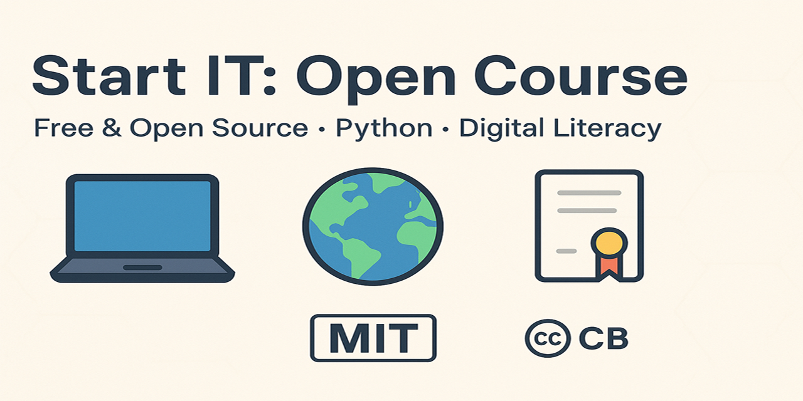

# 🌍 Start IT: Open Course

---

## 🌐 Language / Язык

- 🇷🇺 [Русский](./modules/ru/0-welcome.md)
- 🇬🇧 [English](./modules/en/0-welcome.md)

---

## 📖 About the Project

**EN:** A free open-source course on digital literacy and Python for migrants, women, and seniors.  
**RU:** Бесплатный open-source курс по цифровой грамотности и Python для мигрантов, женщин и пожилых.

Our mission: to lower the entry barrier into IT and help underrepresented groups take their first steps in programming.

---

## 📚 Course Structure

- `modules/ru` and `modules/en` → lessons in Russian and English
- `solutions/ru` and `solutions/en` → sample solutions
- `cert/` → certificate generator
- `.github/workflows/certificate.yml` → GitHub Actions automation

---

## 🛠 How to Get a Certificate

1. Complete all modules.
2. Go to **GitHub Actions → Generate Certificate → Run workflow**.
3. Enter your name → download PDF from artifacts.

---

## 📊 Roadmap

- [ ] Add SQL basics
- [ ] Add Git and GitHub module
- [ ] Add mini web project (HTML+CSS+Python backend)
- [ ] Expand translations (ES, UA)

---

## 🤝 Contributing

Contributions are welcome! Please read [CONTRIBUTING.md](./CONTRIBUTING.md) and follow our [Code of Conduct](./CODE_OF_CONDUCT.md).

---

## 📜 License

- Code → [MIT](./LICENSE)
- # Content → [CC BY 4.0](./LICENSE-CC-BY-4.0)

# start-it-course

Free open-source course on digital literacy and Python for migrants, women, and seniors. 🌍 Multilingual (EN/RU), hands-on tasks, free certificate.

> > > > > > > 052f6ae447c8d8acdc0716376dae934fe7e7ee7e
